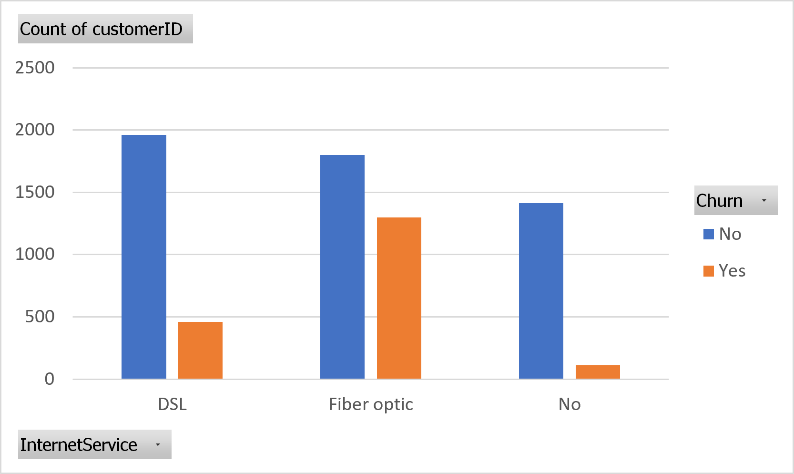

# 📊 Customer Churn Analysis

A data analysis project that explores customer churn patterns in the telecommunications industry using Microsoft Excel. This project identifies key operational factors influencing customer retention and provides data-driven business recommendations through interactive dashboards.

---

## 📌 Project Overview

Customer churn is one of the most important business challenges in the telecommunications industry. In this project, I analyzed the **IBM Telco Customer Churn Dataset** to understand how technical support services and internet infrastructure influence customer retention.

The analysis includes data cleaning, PivotTable summarization, PivotChart visualization, and business interpretation to generate actionable insights.

---

## 🎯 Objectives

- Clean and organize raw customer data.
- Analyze customer churn patterns.
- Identify operational factors contributing to customer churn.
- Build interactive dashboards using PivotTable and PivotChart.
- Deliver business recommendations based on analytical findings.

---

## 🛠️ Tools & Technologies

- Microsoft Excel
- PivotTable
- PivotChart
- Data Cleaning
- Data Visualization

---

## 📂 Dataset

**IBM Telco Customer Churn Dataset**

- Source: https://www.kaggle.com/datasets/blastchar/telco-customer-churn
- Approximately **7,000+ customer records**

---

## 📊 Key Findings

### 🔹 Technical Support Analysis

Customers **without Technical Support services** show the highest likelihood of churning, indicating that technical assistance plays an important role in customer retention.

### 🔹 Internet Service Analysis

Customers using **Fiber Optic** internet services have the highest churn rate compared to DSL and customers without internet services.

---

## 💡 Business Recommendations

Based on the analysis, several strategic recommendations were proposed:

- Conduct preventive maintenance on Fiber Optic infrastructure.
- Offer complimentary Technical Support for new Fiber Optic customers during the first three months.
- Implement AI-based network anomaly detection to identify service disruptions before they affect customers.

---

## 📷 Dashboard Preview

### Technical Support Analysis

Customers without Technical Support services have a significantly higher tendency to discontinue the service.

---

### Internet Service Analysis

Fiber Optic customers exhibit the highest churn rate among all internet service categories.

---

## 📁 Repository Contents

- 📄 Customer_Churn_Analysis.pptx
- 📊 Customer_Churn_Dashboard.xlsx
- 🖼️ images/
  - tech-support-analysis.png
  - internet-service-churn.png

---

## 👨‍💻 Author

**Bintang Darma Sakti**

Information Technology Student  
Telkom University

**Areas of Interest**
- Software Development
- Data Analytics
- Artificial Intelligence
